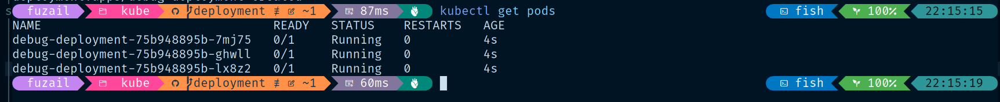

# Debugging Process

First of all, I make a deployment.yaml file containing the deployment that has to be fixed. The first thing I do is checkout to my debug branch and run the deployment.

```
kubectl apply -f deployment.yaml
```

Got this error:


This error due to the cpu and memory limit. So I adjust the request and limits, so that the requests not exceed the limit of cpu and memory. Then I run the deployment again.

Got this second error:


We have to check the docker image. Does image version exist? seems that this nginx:1.27.1 version is not available. So I change the nginx image version to latest. Then, run it again.

It looks just fine


However when I check the minikube dashboard. Its all red!


Seems that the endpoint of /healtz doesn't exist. So I decided to delete it and change the port to 80. But I wanna try something else. I want to redirect the port 80 to 8080. So I create the ConfigMap to for my nginx configuration to listen to port 8080.

Now everything is running properly


Let's try to check the app!
By running this command `minikube service debug-deployment --url` I am able to interact with the services running in the minikube cluster


